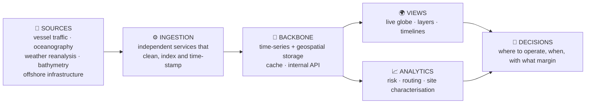
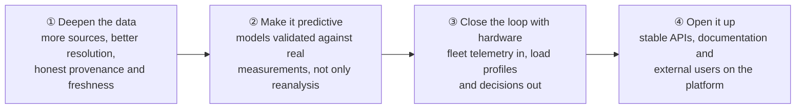

# 🗺️ Kyma

### Offshore Intelligence — the sea, made readable.

**A geo & marine intelligence platform that fuses environmental data and human activity into a live, predictive picture of the ocean.**

---

## 🧭 The thesis

The ocean covers most of the planet and produces most of its weather, food and energy potential — and we still navigate it almost blind, with data scattered across scientific portals, satellite feeds and proprietary trackers that never meet in one place.

**Kyma exists to make the sea readable.** It takes the fragmented reality of marine data — waves, currents, temperature, bathymetry, vessel traffic, offshore infrastructure, environmental risk — and turns it into a single, queryable, predictive map that a person can act on in seconds.

Behind it there is a simple conviction: **the ocean is not an empty space, it is a territory with rules, traffic, assets and dynamics** — and whoever can read it can operate on it safely, sustainably and profitably.

> **Data is not a report. It is a view of the world while it happens.**

---

## 🗺️ What Kyma is

**A geospatial and temporal hub** that ingests heterogeneous marine data flows, harmonises them, and publishes them as an interactive cartography — plus a set of analytics and APIs layered on top.

In the live platform you can switch whole dimensions of reality on and off: navigation data, oceanographic data, geology, offshore infrastructure; filter the fleet by vessel category; follow trajectories; scrub a shared timeline through waves, wave period and direction, currents, sea temperature, salinity, sea level, bathymetry — and through the biological layers of the water column, from pH and dissolved oxygen to nutrients and chlorophyll.

---

## 🐙 Two lives: instrumentation and product

Kyma was born to **operate and evolve Origami's offshore fleet** — tracking devices, correlating their behaviour with sea conditions and closing the loop between what we measure at sea and what we design on land. That remains its first job.

But the platform does not depend on that fleet existing. **It stands on its own as a blue-economy product**, and it can generate recurring revenue before the first Origami float is in the water:

- 🛠️ **Instrumentation** — fleet telemetry, digital twin of each node, field data turned into the load profiles that drive laboratory and sea trials.
- 💼 **Product** — marine domain awareness, critical infrastructure protection, weather routing, offshore site characterisation, ocean data analytics for operators, shipowners and research centres.

The same asset serves both: one platform, one data model, two customers.

---

## 🌐 What it unifies

| Source | What it brings |
|---|---|
| **AIS** | Vessel traffic: who is where, moving how, in real time |
| **Copernicus Marine (CMEMS)** | Oceanography: currents, temperature, sea state, forecasts |
| **ERA5** | Weather reanalysis — the historical and global backdrop |
| **EMODnet** | High-resolution bathymetry and European marine data |
| **CEMS** | Emergency and early-warning information |
| **Ocean & geology layers** | Seabed, sediments, offshore assets and infrastructure |

Different providers, different formats, different cadences — one place to look at them together, on the same clock.

---

## 🚀 What you can do with it

1. **Operate offshore systems** — monitor a fleet or an offshore asset, predict maintenance, understand performance against the sea, not against a spreadsheet.
2. **Marine domain awareness** — see where natural dynamics and human activity overlap: submerged cables and pipelines, platforms, protected areas, unusual patterns.
3. **Weather routing** — optimal ship routes computed on wind, waves and currents, cutting fuel and emissions.
4. **Site characterisation for marine renewables** — find and rank offshore sites for wave converters and floating wind with real sea-state statistics.
5. **Power autonomous agents** — structured APIs and a clean data model so predictive models, simulations and autonomous systems can act on live marine context.

---

## ⚙️ How it is built

A deliberately modular architecture: **independent services** that each own one data domain, a **shared containerised runtime** with a single gateway in front, a **time-series and geospatial backbone** for continuous and positional data, and a **WebGL cartographic frontend** that renders the whole picture smoothly at global scale.

The design rule is the same one we apply to our hardware: **small, replaceable modules, no single point of failure, and complexity living in the connections.**

---

## 🔗 Related to Origami

Kyma is one of the three pillars of the [Origami](https://github.com/Origami-WEC) programme — the one that connects the ocean to the laboratory and to the market: the fleet generates data, Kyma turns data into understanding, understanding feeds the next design iteration.

→ **Parent organization: [github.com/Origami-WEC](https://github.com/Origami-WEC)**

---

## 🌊 What we are working on now

**And what we are honest about.** Marine data is never as clean or as fresh as it looks in a demo: sources disagree, forecasts drift, coverage is uneven and provenance matters. Turning that into something a captain, an engineer or a regulator can trust is the real engineering problem — and it is the one we are solving.

---

## 📞 Get in touch

| | |
|---|---|
| 🌐 **Platform** | [kyma.origami-technology.com](https://kyma.origami-technology.com) |
| 🐙 **Origami** | [www.origami-technology.com](https://www.origami-technology.com) |
| 💼 **LinkedIn** | [Origami Technology](https://www.linkedin.com/company/origamitechnology) |
| ✉️ **Email** | [info@origami-technology.com](mailto:info@origami-technology.com) |
| 📍 **Where** | Italy 🇮🇹 |

 
<b>Kyma does not describe the sea after the fact. It shows the sea while it is happening.</b>

